# Tech-Blog

## Badge
[]
 

## Table of Contents
- [Description](#description)
- [Screenshots](#screenshots)
- [Usage](#usage)
- [What I Have Learned](#what-i-have-learned)
- [Credits](#credits)
- [Licenses](#licenses)

## Description
Challenge 14 coursework for UT bootcamp. Uses Handlebars, Sequelize, 'express-sessions', and Heroku.  
This is a full-stack application for a tech blog, where the user can view posts and comments from  
other users, and login to create their own posts and comments. The logged-in user can also  
update and delete their own posts/comments. They can also log out, or be   
logged out after a set amount of time has passed.  

## Screenshots
---Main page---  
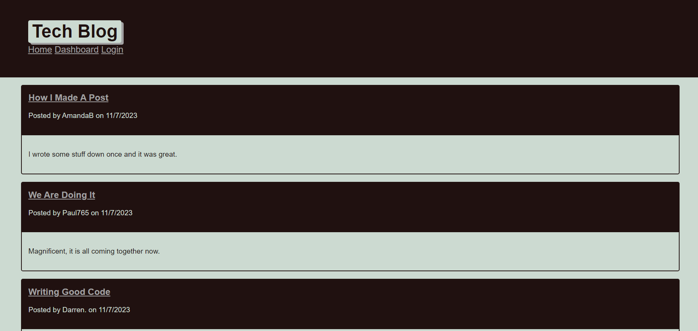

---Viewing all posts---  
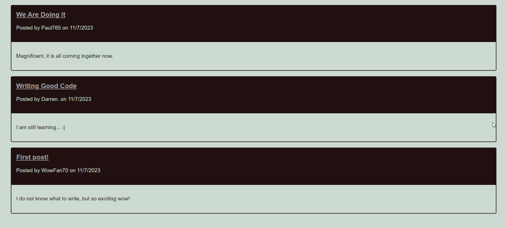

---Clicking on a post---  
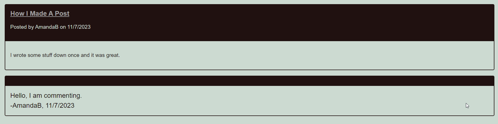

---Logging on---  
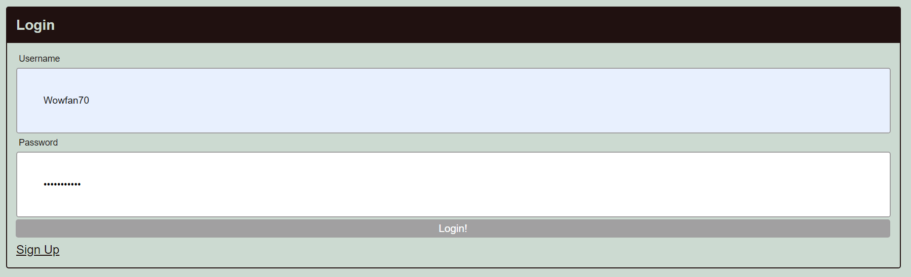

---Going to dashboard to make a post---  
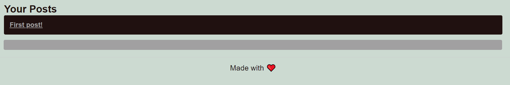

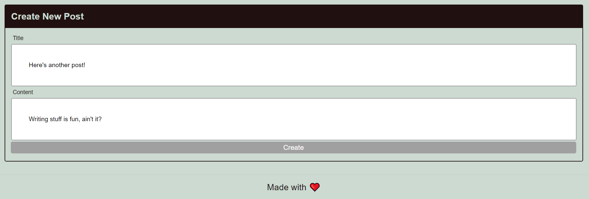

---Editing post---  
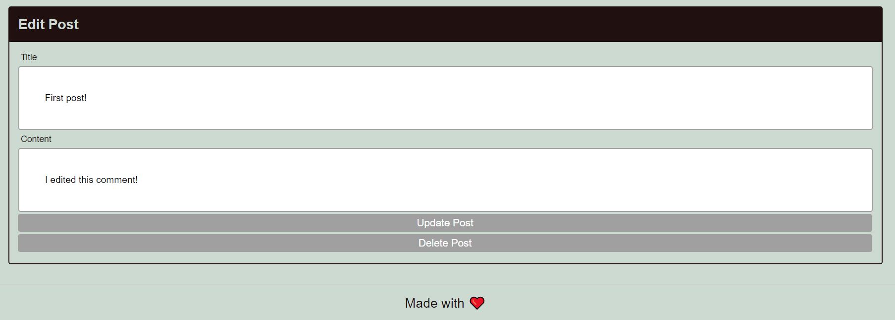

---Seeing edited post (comment) on main page---  
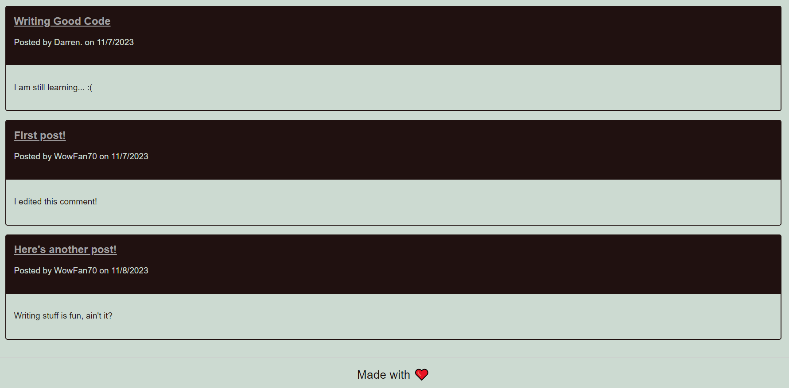

---Deleting post and viewing page after deletion---  
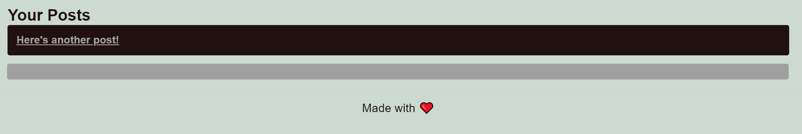

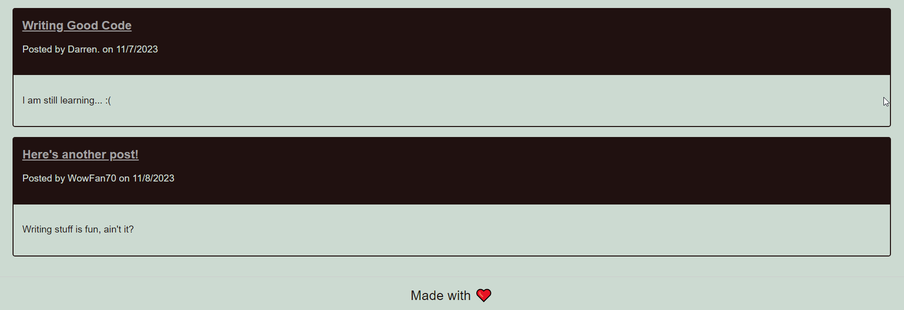

---Signing up---  
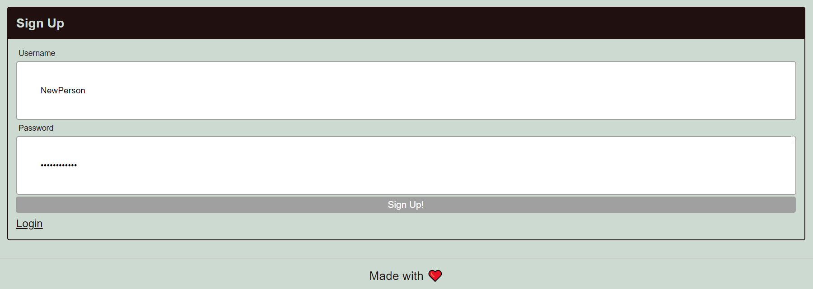

## Usage
Simply click on the link and watch the magic happen.    
Link to the website: OFFLINE  

## What I Have Learned
I've formed a good foundation for MVC structure, route creations, connections between files,  
seeding the database, and understanding how to have JavaScript files interact with Handlebars.  
All of this newfound knowledge leading up to the creation of a full-stack application.  

## Credits
Made by Allie Stewart.  
Lots of help from my module 14 mini-project notes, as well as  
https://stackoverflow.com.  

## Licenses
Please refer to the LICENSE in the repository.  
